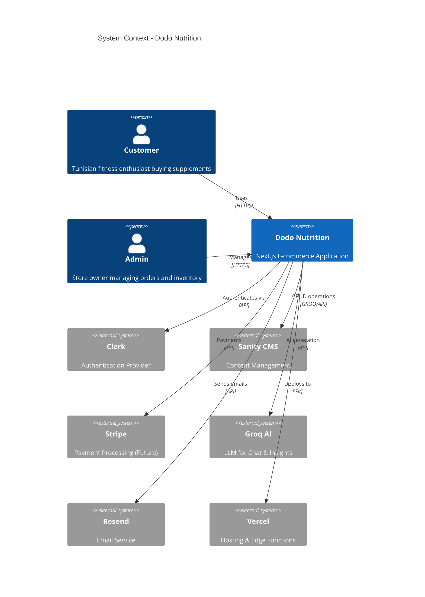
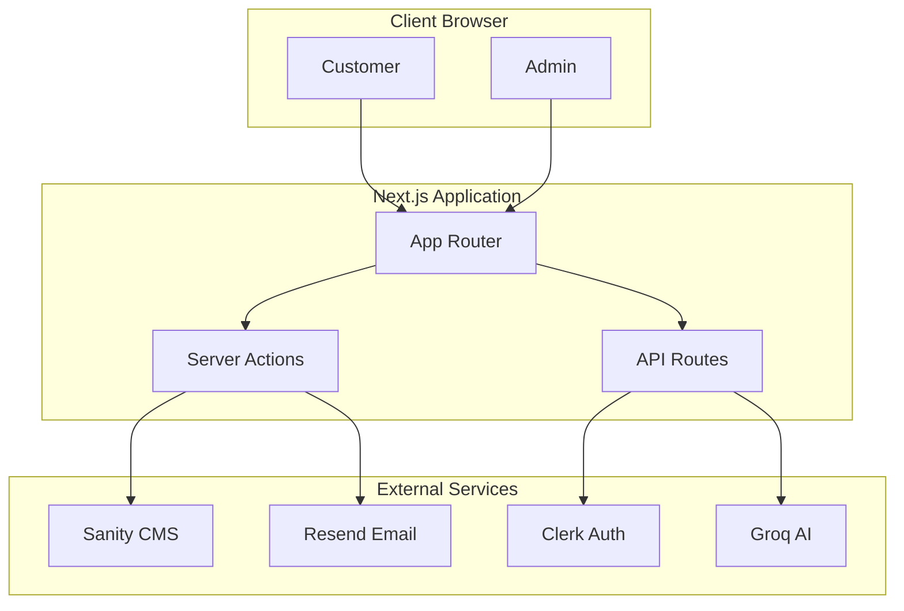
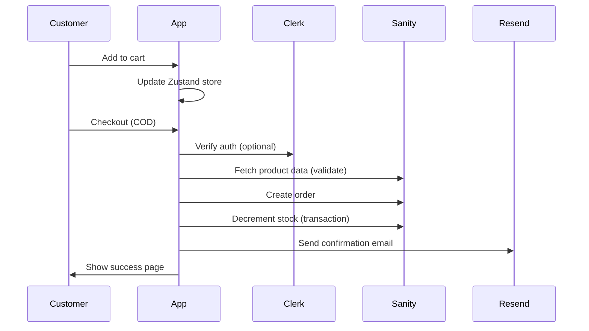

# System Context Diagram

> **Project**: Dodo Nutrition  
> **Purpose**: High-level system boundaries and integrations

---

## Overview



---

## Simplified Flow Diagram



---

## Data Flow

### Customer Order Flow



---

## External Services

| Service    | Purpose             | Auth Method     |
| ---------- | ------------------- | --------------- |
| **Clerk**  | User authentication | API Keys        |
| **Sanity** | CMS + Database      | Project Token   |
| **Groq**   | AI chat + insights  | API Key         |
| **Resend** | Transactional email | API Key         |
| **Stripe** | Future payments     | Secret Key      |
| **Vercel** | Hosting             | Git integration |

---

## Environment Variables Required

```
# Auth
NEXT_PUBLIC_CLERK_PUBLISHABLE_KEY
CLERK_SECRET_KEY

# CMS
NEXT_PUBLIC_SANITY_PROJECT_ID
NEXT_PUBLIC_SANITY_DATASET
SANITY_API_WRITE_TOKEN

# AI
GROQ_API_KEY

# Email
RESEND_API_KEY

# Admin
ADMIN_EMAILS

# Payments (future)
STRIPE_SECRET_KEY
STRIPE_WEBHOOK_SECRET
```
