# Homepage Redesign Brief — Dodo Nutrition

> **Date**: 2026-02-14
> **Priority**: ⭐ #1 Before Launch
> **Approach**: Discussion document — not a final spec

---

## 1. Deep Audit: Current Homepage

### Current Section Order (11 Components)

```mermaid
graph TD
    A["1. HeroSection ❌"] --> B["2. TrustBar ⚠️"]
    B --> C["3. CategoryShowcase ⚠️"]
    C --> D["4. BannerSection (CMS) ✅"]
    D --> E["5. FeaturedPacks ⚠️"]
    E --> F["6. FeaturedProducts ⚠️"]
    F --> G["7. PromoBanner ❌"]
    G --> H["8. BrandsCarousel ⚠️"]
    H --> I["9. WhyUsSection ❌"]
    I --> J["10. TestimonialsSection ⚠️"]
    J --> K["11. NewsletterSection ⚠️"]
```

### Problem Analysis

| #   | Component               | Problem                                                                                                                                                                                                | Severity    |
| --- | ----------------------- | ------------------------------------------------------------------------------------------------------------------------------------------------------------------------------------------------------ | ----------- |
| 1   | **HeroSection**         | Text-only slides with CSS gradient fallbacks — **no images, no video, no visual impact**. CTA buttons mix Arabic (اكتشف المتجر) with French titles. Generic slogans ("Performance. Force. Résultats.") | 🔴 Critical |
| 2   | **TrustBar**            | Redundant — repeats exact same info as WhyUsSection (delivery, quality, support, payment). Takes space without adding value                                                                            | 🟠 High     |
| 3   | **CategoryShowcase**    | Uses **emoji icons** (🥛💪⚡💊) instead of actual images. Only 8 categories hardcoded, user says there should be 10+                                                                                   | 🟠 High     |
| 4   | **BannerSection**       | ✅ Works well — CMS-driven from Sanity. Good slider implementation                                                                                                                                     | ✅ OK       |
| 5   | **FeaturedPacks**       | Basic card grid, no visual impact. No CTA explaining bundle value                                                                                                                                      | 🟡 Medium   |
| 6   | **FeaturedProducts**    | Basic grid, shows up to 8 products. No "best-seller" badges. Positioned after packs (should be higher)                                                                                                 | 🟡 Medium   |
| 7   | **PromoBanner**         | **Fake countdown** — hardcoded `Date.now() + 7 days`, resets every visit. Not CMS-driven. Feels dishonest                                                                                              | 🔴 Critical |
| 8   | **BrandsCarousel**      | Works but visually weak — just brand names in cards. No brand logos/images                                                                                                                             | 🟡 Medium   |
| 9   | **WhyUsSection**        | **6 cards** taking enormous space — overlaps TrustBar content. 4 stat counters are fabricated ("5000+ Clients Satisfaits")                                                                             | 🔴 Critical |
| 10  | **TestimonialsSection** | Functional, fetches from Sanity. Could be better styled                                                                                                                                                | 🟡 Medium   |
| 11  | **NewsletterSection**   | Form has no backend (`// TODO: Integrate with email service`). Promises 10% discount that doesn't exist                                                                                                | 🟠 High     |

### Core Issues Summary

1. **No visual identity** — The hero is text on a dark background. No product images, no brand personality, no energy
2. **Redundancy** — TrustBar + WhyUs say the same thing, both taking full sections
3. **Fake content** — Countdown timer resets, "5000+ clients", newsletter discount — all fabricated
4. **No guidance** — User lands and sees generic text. No "What are you looking for?" flow
5. **Mixed languages** — French titles, Arabic CTAs, no consistency
6. **Too long** — 11 sections means excessive scrolling with repeating information

---

## 2. Proposed Structure: New Homepage

### Philosophy

> L'utilisateur arrive, il est **guidé** immédiatement. Il ne scroll pas dans le vide — chaque section a un **but précis** et le pousse vers son objectif (trouver ce qu'il cherche → acheter).

### Target Audience Recap

| Segment          | Profile                            | What They Want                  |
| ---------------- | ---------------------------------- | ------------------------------- |
| 🏋️ **Primary**   | Fitness, gym-goers (18-35)         | Proteins, creatine, pre-workout |
| 🏃 **Secondary** | Athletes, bodybuilders             | Performance, bulk, stacks       |
| 🌿 **Tertiary**  | Health-conscious, women, bien-être | Vitamins, wellness, santé       |

### New Section Flow (9 Sections)

```mermaid
graph TD
    H["① HERO — Impact + Guidance"] --> G["② GOAL NAVIGATOR — 'Chnoua tlawwej aalih?'"]
    G --> F["③ FEATURED — Best-sellers + Editor's Picks"]
    F --> B["④ CMS BANNERS — Promos from Sanity"]
    B --> P["⑤ PACKS & DEALS — Bundles spotlight"]
    P --> C["⑥ CATEGORIES — Visual grid with images"]
    C --> S["⑦ SOCIAL PROOF — Reviews + Brand Trust"]
    S --> BR["⑧ BRANDS — Logo carousel"]
    BR --> CTA["⑨ FINAL CTA — AI Assistant + Newsletter"]
```

---

## 3. Section-by-Section Specification

### ① HERO — "Le Premier Impact"

**Goal**: Instant visual impact. User feels "this is premium, this is serious."

**Option A: Video Hero** (Recommended if owner has video content)

- Full-width background video (the owner's content — gym, supplements, lifestyle)
- Text overlay: brand tagline, one strong CTA
- Auto-muted, loops, with fallback image for slow connections

**Option B: Dynamic Banner Hero** (If no video)

- CMS-driven banners from Sanity (reuse existing BannerSection logic)
- Full-bleed images with text overlay
- Auto-slide with manual control

**Option C: Split Hero** (Hybrid)

- Left: Strong text + CTA + search bar
- Right: Product image or short video loop
- Mobile: stacks vertically, video becomes compact

> [!IMPORTANT]
> **User has video content** — the owner is a content creator. Video hero is the strongest option for supplement stores in 2025. Myprotein, Bulk, and The Protein Works all use video/lifestyle imagery.

**CTA Strategy**:

- Primary: "Découvrir la Boutique" → /shop
- Secondary: "Nos Packs" → /packs (bundles = higher AOV)

**Trust Strip** (compact, inside hero or just below):

- 4 icons in a single bar: 🚛 Livraison 24-48h | ✅ 100% Authentique | 💰 Paiement à la livraison | 🔄 Retour 14j
- Replaces current TrustBar + eliminates WhyUs redundancy

---

### ② GOAL NAVIGATOR — "Chnoua Tlawwej Aalih?"

**Goal**: Guide undecided users. "I don't know what I need" → "Here's your path."

**Design**: 3-4 large interactive tiles, visually rich:

| Tile                                    | Icon/Image        | Destination            |
| --------------------------------------- | ----------------- | ---------------------- |
| 💪 "Ndhabber w Nqawwi" (Muscle & Force) | Gym/muscle image  | /shop?goal=muscle      |
| ⚡ "Nzid Performance" (Performance)     | Pre-workout image | /shop?goal=performance |
| 🔥 "Ndhabber w Ndhaeef" (Sèche & Perte) | Lean body image   | /shop?goal=weight-loss |
| 🌿 "Santé w Bien-être" (Vitamines)      | Wellness image    | /shop?goal=wellness    |

> [!TIP]
> This is the **key differentiator** vs generic supplement stores. Instead of just categories by product type (protéines, créatine), we categorize by **user goal**. A woman looking for wellness doesn't think "je veux des vitamines" — she thinks "je veux me sentir mieux".

**Mobile**: 2x2 grid with large tap targets. Swipeable on very small screens.

**Alternative**: Could be a quiz-style "Answer 3 questions → get your stack" (more complex, could be v2).

---

### ③ FEATURED — Best-sellers + Editor's Picks

**Goal**: Show top products immediately. Social proof through "best-seller" badges.

**Layout**:

- Horizontal scrollable carousel (mobile) / 4-column grid (desktop)
- Each card: product image, name, price, rating stars, "Best-seller" / "Nouveau" badge
- Toggle tabs: "Best-sellers" | "Nouveautés" | "En Promo"

**Data**: From Sanity `featured` flag, sortable by `salesCount`, `createdAt`, or `hasPromotion`.

**Improvement over current**: Current FeaturedProducts is a static grid of 8. New version adds badges, tabs, and carousel on mobile.

---

### ④ CMS BANNERS — Promo Campaigns

**Goal**: Owner-controlled promotional space.

**Keep**: Current BannerSection component — it works well with Sanity CMS. Owner uploads banners in Studio, they appear here.

**Improvement**: Full-bleed (edge to edge), no section header text.

---

### ⑤ PACKS & DEALS — Bundle Spotlight

**Goal**: Push bundles. Higher AOV. "Économisez X DT avec ce pack."

**Layout**:

- 2-3 featured packs in a horizontal layout
- Each pack: visual card showing included products, total value vs pack price, savings badge
- Strong CTA: "Voir le Pack" or "Ajouter au Panier"

**Key**: User has 15+ packs. This section should spotlight 2-3 "featured" packs that rotate.

**Improvement over current**: Current FeaturedPacks is a basic card grid. New version emphasizes savings and value proposition.

---

### ⑥ CATEGORIES — Visual Navigation

**Goal**: Browse by category with rich imagery.

**Layout**:

- Grid of image cards (2 cols mobile, 4-5 cols desktop)
- Each card: Category image (AI-generated or real), category name, product count
- Hover: subtle zoom effect

**Categories** (updated mapping, 10+):

| Category             | Slug          | Image Needed     |
| -------------------- | ------------- | ---------------- |
| Protéines            | proteines     | ✅ Need AI image |
| Créatine             | creatine      | ✅ Need AI image |
| Pre-Workout          | pre-workout   | ✅ Need AI image |
| Vitamines & Minéraux | vitamines     | ✅ Need AI image |
| Brûleurs de Graisse  | bruleurs      | ✅ Need AI image |
| Boosters Hormonaux   | boosters      | ✅ Need AI image |
| Acides Aminés        | acides-amines | ✅ Need AI image |
| Barres & Snacks      | barres-snacks | ✅ Need AI image |
| Santé & Bien-être    | sante         | ✅ Need AI image |
| Accessoires          | accessoires   | ✅ Need AI image |

> [!IMPORTANT]
> User confirmed they need images for categories. I can generate AI images matching the brand's dark theme + yellow/red accent colors.

---

### ⑦ SOCIAL PROOF — Reviews + Trust

**Goal**: Build confidence. Real reviews from real customers.

**Design**: Combines current TestimonialsSection with a compact trust section:

- Top: Star rating summary ("⭐ 4.8/5 — basé sur X avis")
- Carousel of recent 5-star reviews with customer names
- Optional: "As seen on" or "Used by X athletes in Tunisia"

**Replaces**: Current TestimonialsSection + WhyUsSection (no more 6 generic cards)

---

### ⑧ BRANDS — Logo Marquee

**Goal**: Show legitimate brand partnerships.

**Layout**: Auto-scrolling horizontal marquee of brand logos. No section title needed — the logos speak for themselves.

**Improvement**: Current BrandsCarousel shows text cards. New version shows actual brand logos (need images from owner or generate placeholders).

---

### ⑨ FINAL CTA — AI Assistant + Newsletter

**Goal**: Catch users before they leave. Two options:

1. "Besoin d'aide? Demandez à notre assistant AI" → opens AI chat
2. Newsletter signup (only if backend is connected)

**Design**: Compact, one row. Not a full section like current NewsletterSection.

**Note**: Newsletter backend is NOT ready (currently just `// TODO`). Options:

- A) Keep visual but add "Bientôt disponible" until backend ready
- B) Remove newsletter, focus only on AI assistant CTA
- C) Connect to Resend Audiences now (30min task)

---

## 4. What Disappears

| Current Component                    | Action                         | Why                                          |
| ------------------------------------ | ------------------------------ | -------------------------------------------- |
| **TrustBar**                         | → Merged into Hero trust strip | Was redundant with WhyUs                     |
| **WhyUsSection** (6 cards + 4 stats) | → Merged into Social Proof     | Took too much space, fabricated stats        |
| **PromoBanner** (fake countdown)     | → Deleted                      | Dishonest countdown, use CMS banners instead |
| **NewsletterSection** (no backend)   | → Compact CTA or remove        | Backend not connected                        |

---

## 5. Mobile-First Patterns

| Pattern               | Implementation                                    |
| --------------------- | ------------------------------------------------- |
| **Hero**              | Video/banner takes full viewport height on mobile |
| **Goal Navigator**    | 2x2 grid with large touch targets                 |
| **Featured Products** | Horizontal swipeable carousel                     |
| **Categories**        | 2-column grid, tap to browse                      |
| **Social Proof**      | Swipeable review cards                            |
| **Brands**            | Auto-scrolling marquee                            |

**Key mobile rules**:

- Every section must be thumb-friendly
- No section should require more than 2 swipes to understand
- CTA buttons minimum 48px height
- Product cards show price + "Add to cart" without expanding

---

## 6. Content Requirements from User

| Content                           | Source                      | Status             |
| --------------------------------- | --------------------------- | ------------------ |
| Brand video (vertical/horizontal) | Owner (content creator)     | ✅ User has videos |
| Category images                   | AI-generated or design team | ⬜ Need to create  |
| Brand logos                       | From suppliers / owner      | ⬜ Need from owner |
| Real review data                  | From Sanity (existing)      | ✅ Already fetched |
| Featured products/packs           | From Sanity (existing)      | ✅ Already works   |

---

## 7. Questions for Discussion

1. **Hero format**: Video (owner's content) vs CMS banner vs split layout — which feels right for Dodo?
2. **Goal Navigator**: Should tiles link to filtered /shop or to dedicated goal pages?
3. **Language**: Should homepage be French-primary, Darija-flavored, or bilingual?
4. **AI chat**: Keep the floating widget, or add an explicit section highlighting it?
5. **Newsletter**: Connect backend now (30min) or defer to post-launch?
6. **Category images**: Shall I generate them now (AI) or wait for the design team?
7. **Brands section**: Do you have brand logos, or should I create placeholders?
