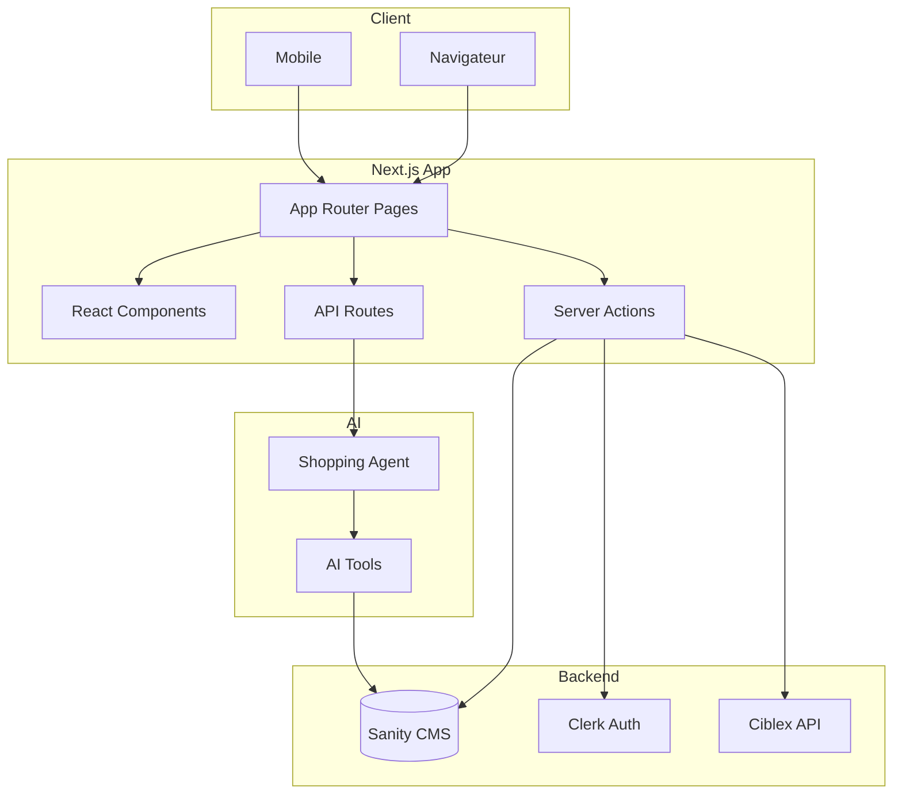
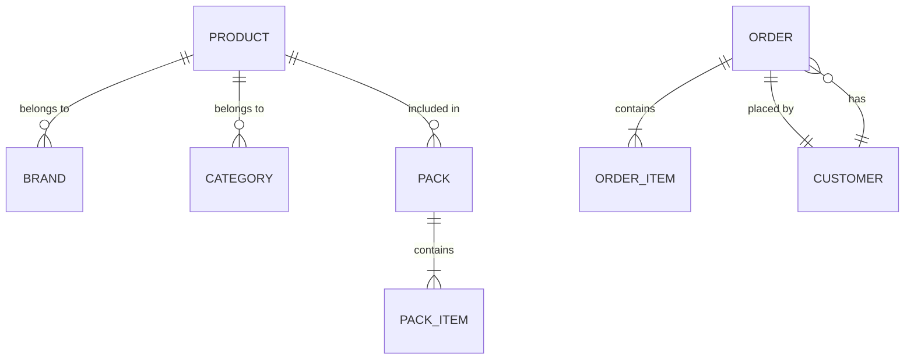
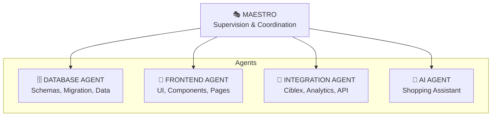
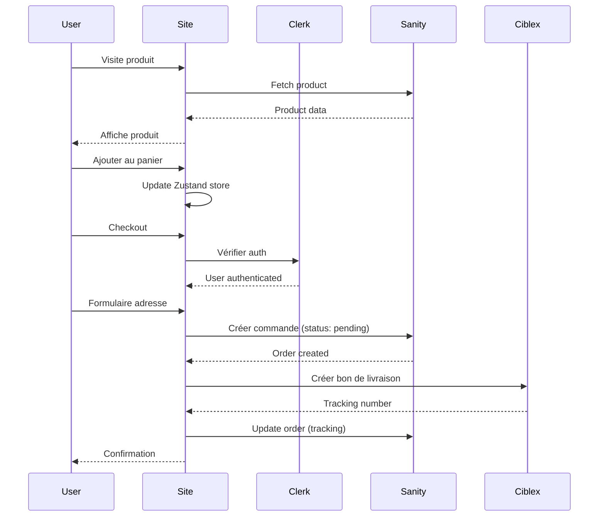
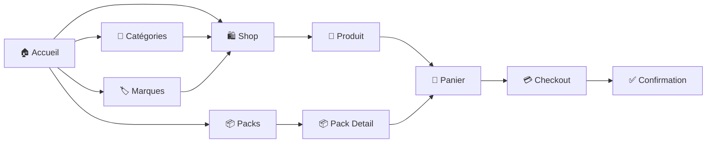
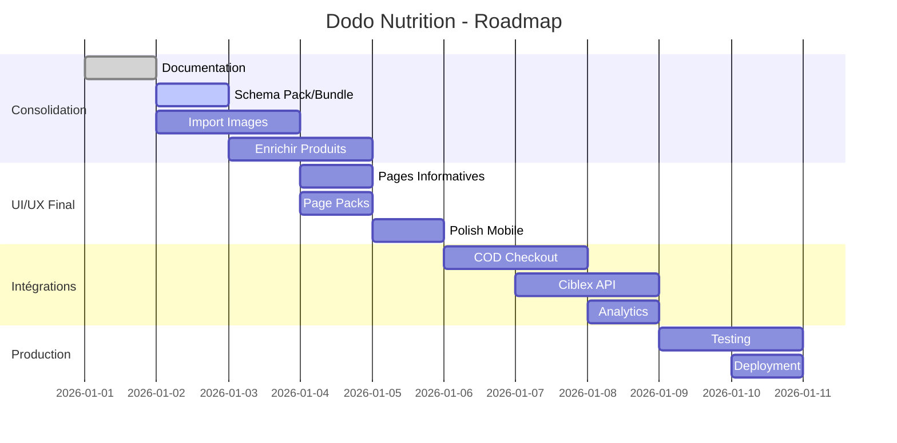

# 🏗️ DODO NUTRITION - Architecture Projet

**Version:** 1.0  
**Date:** 01/01/2026  
**Auteur:** Antigravity (Senior Architect)  
**Status:** Document de Référence Principal

---

## 📋 Table des Matières

1. [Vue d'Ensemble](#vue-densemble)
2. [Architecture Technique](#architecture-technique)
3. [Schémas Base de Données](#schémas-base-de-données)
4. [Structure des Fichiers](#structure-des-fichiers)
5. [Domaines & Agents](#domaines--agents)
6. [Flows Utilisateur](#flows-utilisateur)
7. [Assets & Médias](#assets--médias)
8. [Roadmap](#roadmap)

---

## 🎯 Vue d'Ensemble

### Qu'est-ce que Dodo Nutrition ?

E-commerce B2C de nutrition sportive pour le marché tunisien.

### Stack Technique

| Couche    | Technologie             |
| --------- | ----------------------- |
| Frontend  | Next.js 16 (App Router) |
| CMS       | Sanity.io               |
| Auth      | Clerk                   |
| State     | Zustand                 |
| Style     | Tailwind CSS v4         |
| AI        | Vercel AI SDK           |
| Paiement  | Cash on Delivery (COD)  |
| Livraison | Ciblex API              |

### Environnement

```
NEXT_PUBLIC_SANITY_PROJECT_ID=xxx
NEXT_PUBLIC_SANITY_DATASET=production
SANITY_API_WRITE_TOKEN=xxx
CLERK_*=xxx
```

---

## 🏛️ Architecture Technique



---

## 📊 Schémas Base de Données

### Vue d'Ensemble des Types



### 1. BRAND (Marque)

| Champ         | Type   | Required | Description             |
| ------------- | ------ | -------- | ----------------------- |
| `_id`         | string | ✅       | Identifiant unique      |
| `name`        | string | ✅       | Nom de la marque        |
| `slug`        | slug   | ✅       | URL-friendly identifier |
| `logo`        | image  | ❌       | Logo de la marque       |
| `description` | text   | ❌       | Description             |

**Total actuel:** 21 marques

---

### 2. CATEGORY (Catégorie)

| Champ         | Type   | Required | Description             |
| ------------- | ------ | -------- | ----------------------- |
| `_id`         | string | ✅       | Identifiant unique      |
| `title`       | string | ✅       | Nom de la catégorie     |
| `slug`        | slug   | ✅       | URL-friendly identifier |
| `description` | text   | ❌       | Description             |
| `image`       | image  | ❌       | Image de catégorie      |

**Total actuel:** 8 catégories

- Protéines, Créatine, Pre-Workout, Vitamines, Minéraux, Brûleurs de Graisse, Boosters Hormonaux, Suppléments

---

### 3. PRODUCT (Produit) ⚠️ À ENRICHIR

| Champ             | Type           | Required | Description             | Status           |
| ----------------- | -------------- | -------- | ----------------------- | ---------------- |
| `_id`             | string         | ✅       | Identifiant unique      | ✅               |
| `name`            | string         | ✅       | Nom du produit          | ✅               |
| `slug`            | slug           | ✅       | URL-friendly            | ✅               |
| `description`     | text           | ❌       | Description courte      | ✅               |
| `longDescription` | array          | ❌       | Description rich text   | ⚠️ Vide          |
| `brand`           | ref → Brand    | ✅       | Référence marque        | ✅               |
| `category`        | ref → Category | ✅       | Référence catégorie     | ✅               |
| `image`           | image          | ❌       | Image principale        | ❌ **MANQUANT**  |
| `gallery`         | array[image]   | ❌       | Galerie images          | ❌ **MANQUANT**  |
| `unit`            | string         | ✅       | Unité (g, kg, ml, caps) | ✅               |
| `quantity`        | number         | ✅       | Quantité                | ✅               |
| `servings`        | number         | ❌       | Nombre de portions      | ⚠️ Partiel       |
| `flavors`         | array[string]  | ❌       | Saveurs disponibles     | ⚠️ Partiel       |
| `benefits`        | array[text]    | ❌       | Bénéfices clés          | ⚠️ Partiel       |
| `allergens`       | text           | ❌       | Allergènes              | ⚠️ Vide          |
| `certifications`  | array[string]  | ❌       | Certifications          | ⚠️ Vide          |
| `dosage`          | text           | ❌       | Posologie               | ⚠️ Vide          |
| `priceRetail`     | number         | ✅       | Prix de vente TND       | ✅ (placeholder) |
| `pricePurchase`   | number         | ❌       | Prix d'achat TND        | ✅ (placeholder) |
| `priceWholesale`  | number         | ❌       | Prix gros TND           | ✅ (placeholder) |
| `priceSlashed`    | number         | ❌       | Prix barré TND          | ⚠️ Partiel       |
| `stock`           | number         | ✅       | Quantité en stock       | ✅               |
| `featured`        | boolean        | ❌       | Produit vedette         | ⚠️ Partiel       |
| `metaTitle`       | string         | ❌       | SEO Title               | ⚠️ Vide          |
| `metaKeywords`    | string         | ❌       | SEO Keywords            | ⚠️ Vide          |
| `metaDescription` | text           | ❌       | SEO Description         | ⚠️ Vide          |

**Total actuel:** 120 produits
**Problèmes identifiés:**

- ❌ Aucune image de produit
- ⚠️ Prix sont des placeholders
- ⚠️ Champs SEO vides
- ⚠️ Portions/Flavors partiels

---

### 4. PACK (Bundle) 🆕 À CRÉER

> **IMPORTANT:** Les Packs/Bundles sont essentiels pour le business !

| Champ           | Type                 | Required | Description          |
| --------------- | -------------------- | -------- | -------------------- |
| `_id`           | string               | ✅       | Identifiant unique   |
| `name`          | string               | ✅       | Nom du pack          |
| `slug`          | slug                 | ✅       | URL-friendly         |
| `description`   | text                 | ❌       | Description          |
| `image`         | image                | ✅       | Image du pack        |
| `products`      | array[ref → Product] | ✅       | Produits inclus      |
| `priceOriginal` | number               | ✅       | Prix total séparé    |
| `priceBundle`   | number               | ✅       | Prix bundle (réduit) |
| `savings`       | number               | ❌       | Économie calculée    |
| `featured`      | boolean              | ❌       | Bundle vedette       |

---

### 5. ORDER (Commande)

| Champ             | Type             | Required | Description                                   |
| ----------------- | ---------------- | -------- | --------------------------------------------- |
| `_id`             | string           | ✅       | Identifiant unique                            |
| `orderNumber`     | string           | ✅       | Numéro commande                               |
| `customer`        | ref → Customer   | ✅       | Référence client                              |
| `items`           | array[OrderItem] | ✅       | Articles commandés                            |
| `total`           | number           | ✅       | Total TND                                     |
| `shippingAddress` | object           | ✅       | Adresse livraison                             |
| `status`          | string           | ✅       | pending/confirmed/shipped/delivered/cancelled |
| `paymentMethod`   | string           | ✅       | COD                                           |
| `trackingNumber`  | string           | ❌       | Numéro suivi Ciblex                           |
| `createdAt`       | datetime         | ✅       | Date création                                 |

---

### 6. CUSTOMER (Client)

| Champ              | Type           | Required | Description           |
| ------------------ | -------------- | -------- | --------------------- |
| `_id`              | string         | ✅       | Identifiant unique    |
| `clerkId`          | string         | ✅       | ID Clerk              |
| `email`            | string         | ✅       | Email                 |
| `name`             | string         | ✅       | Nom complet           |
| `phone`            | string         | ❌       | Téléphone             |
| `addresses`        | array[Address] | ❌       | Adresses enregistrées |
| `stripeCustomerId` | string         | ❌       | ID Stripe (legacy)    |

---

## 📁 Structure des Fichiers

```
ecommerce-ai/
├── .agent/
│   └── workflows/           # Workflows automatisés
│       ├── database.md      # Workflow DB
│       ├── frontend.md      # Workflow Frontend
│       └── integration.md   # Workflow Intégrations
├── docs/
│   ├── architecture.md      # Ce document
│   ├── database-schema.md   # Schémas détaillés
│   ├── api-reference.md     # API Reference
│   └── deployment.md        # Guide déploiement
├── app/
│   ├── (app)/              # Routes publiques
│   │   ├── page.tsx        # Home (Landing)
│   │   ├── shop/           # Catalogue
│   │   ├── products/       # Détail produit
│   │   ├── categories/     # Pages catégories
│   │   ├── brands/         # Pages marques
│   │   ├── packs/          # 🆕 Pages bundles
│   │   ├── checkout/       # Checkout COD
│   │   └── orders/         # Commandes client
│   ├── (admin)/            # Routes admin
│   └── api/                # API Routes
├── components/
│   ├── layout/             # Header, Footer, Nav
│   ├── home/               # Sections home page
│   ├── app/                # Composants app
│   └── ui/                 # shadcn/ui
├── lib/
│   ├── actions/            # Server Actions
│   ├── sanity/            # Queries GROQ
│   ├── store/             # Zustand stores
│   └── ai/                # AI Agent
├── sanity/
│   └── schemaTypes/       # Schemas Sanity
├── public/
│   ├── brands/            # 🆕 Logos marques
│   ├── products/          # 🆕 Images produits
│   ├── banners/           # 🆕 Banners hero
│   └── packs/             # 🆕 Images packs
└── scripts/               # Scripts migration
```

---

## 👥 Domaines & Agents

### Architecture Multi-Agent



### 🎭 MAESTRO (Moi - Senior Architect)

**Responsabilités:**

- Vision globale et coordination
- Code review et validation
- Documentation principale
- Décisions d'architecture
- Gestion des priorités

**Fichiers gérés:**

- `docs/architecture.md`
- `docs/roadmap.md`
- `.agent/rules.md`

---

### 🗄️ DATABASE AGENT

**Domaine:** Data Layer

**Responsabilités:**

- Schemas Sanity (`sanity/schemaTypes/`)
- Scripts migration (`scripts/`)
- Queries GROQ (`lib/sanity/queries/`)
- Intégrité des données
- Import/Export data

**Fichiers gérés:**

```
sanity/schemaTypes/*.ts
lib/sanity/queries/*.ts
scripts/*.ts
docs/database-schema.md
```

**Tâches actuelles:**

- [ ] Créer schema `packType.ts`
- [ ] Importer images produits
- [ ] Enrichir données produits
- [ ] Créer données packs/bundles

---

### 🎨 FRONTEND AGENT

**Domaine:** UI/UX Layer

**Responsabilités:**

- Pages Next.js (`app/`)
- Composants React (`components/`)
- Styles et Design System
- Responsive design
- Accessibilité

**Fichiers gérés:**

```
app/(app)/**/*.tsx
components/**/*.tsx
app/globals.css
```

**Tâches actuelles:**

- [ ] Pages informatives (about, contact, faq)
- [ ] Page packs/bundles
- [ ] Optimiser images
- [ ] Améliorer mobile UX

---

### 🔌 INTEGRATION AGENT

**Domaine:** External Services

**Responsabilités:**

- API Ciblex (livraison)
- Analytics (GA, Pixel)
- CAPI (Conversions API)
- Webhooks
- Email (transactionnel)

**Fichiers gérés:**

```
lib/actions/*.ts
app/api/**/*.ts
lib/services/*.ts
docs/api-reference.md
```

**Tâches futures:**

- [ ] Intégration Ciblex API
- [ ] Setup Google Analytics
- [ ] Setup Facebook Pixel
- [ ] Setup conversion tracking

---

### 🤖 AI AGENT

**Domaine:** Shopping Assistant

**Responsabilités:**

- Configuration agent (`lib/ai/`)
- Tools de recherche
- Instructions et prompts
- Tests et optimisation

**Fichiers gérés:**

```
lib/ai/**/*.ts
```

---

## 🔄 Flows Utilisateur

### Flow Achat (COD)



### Flow Navigation



---

## 🖼️ Assets & Médias

### Assets Requis

| Type              | Quantité | Format    | Emplacement                | Status        |
| ----------------- | -------- | --------- | -------------------------- | ------------- |
| Logo Dodo         | 1        | PNG       | `/logo_dodo_nutrition.png` | ✅            |
| Logos Brands      | 21       | PNG/SVG   | `/public/brands/`          | ❌ À importer |
| Images Produits   | 120+     | WEBP      | `/public/products/`        | ❌ À importer |
| Banners Hero      | 3-5      | WEBP      | `/public/banners/`         | ❌ À créer    |
| Images Packs      | 10+      | WEBP      | `/public/packs/`           | ❌ À créer    |
| Icônes Catégories | 8        | SVG/Emoji | Code                       | ✅ Emoji      |

### Structure Assets

```
public/
├── logo_dodo_nutrition.png     ✅ Existant
├── brands/
│   ├── real-pharm.png          ❌ À importer
│   ├── biotech-usa.png         ❌ À importer
│   └── ...
├── products/
│   ├── [product-slug].webp     ❌ À importer
│   └── ...
├── banners/
│   ├── hero-1.webp             ❌ À créer
│   ├── hero-2.webp             ❌ À créer
│   └── ...
└── packs/
    ├── pack-masse.webp         ❌ À créer
    └── ...
```

---

## 📅 Roadmap

### Phase Actuelle: CONSOLIDATION



### Priorités Immédiates

1. **🗄️ DATABASE** - Créer schema Pack, importer images
2. **📄 DATA** - Enrichir produits (descriptions, portions, etc.)
3. **🎨 UI** - Pages packs, pages info
4. **🔌 INTEGRATION** - COD, Ciblex
5. **🚀 DEPLOY** - Tests, mise en production

---

## 📚 Documents Connexes

- [Database Schema](file:///C:/Users/Mohamed%20Ali%20Jardak/.gemini/antigravity/scratch/ecommerce-ai/docs/database-schema.md)
- [Task Checklist](file:///C:/Users/Mohamed%20Ali%20Jardak/.gemini/antigravity/brain/92ef5138-1b28-48ba-959f-cca7e9153095/task.md)
- [Implementation Plan](file:///C:/Users/Mohamed%20Ali%20Jardak/.gemini/antigravity/brain/92ef5138-1b28-48ba-959f-cca7e9153095/implementation_plan.md)

---

**Ce document est la source de vérité pour l'architecture du projet Dodo Nutrition.**
