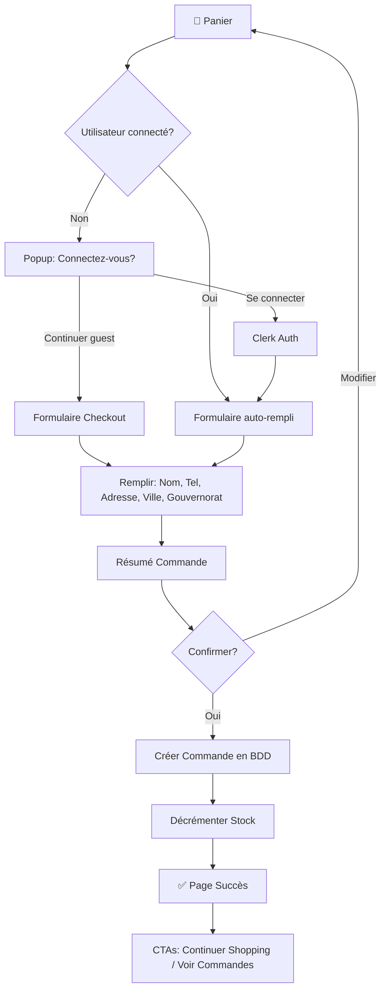
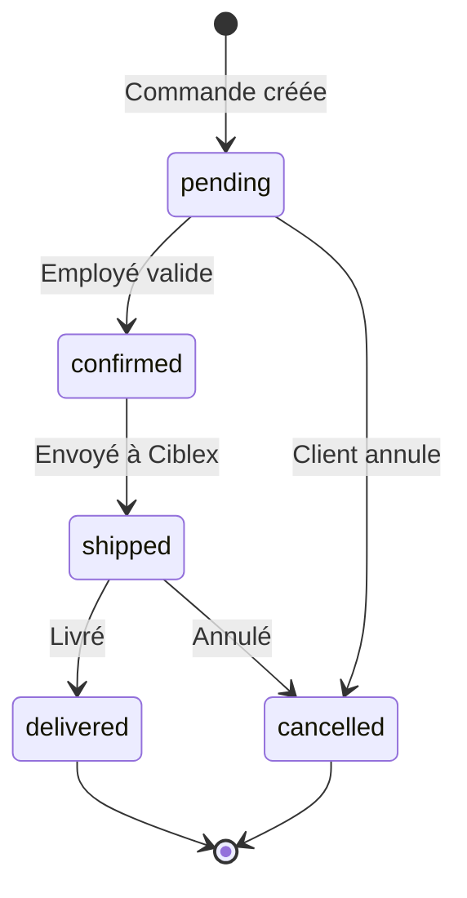

# Feature 004: COD Checkout System

> **Slug**: `cod-checkout`  
> **Priority**: 🔴 Critical  
> **Status**: Draft

---

## 🎯 Goal

Replace the current Stripe-based checkout with a **Cash on Delivery (COD)** system designed for the Tunisian market. The checkout must be simple, fast, and support both authenticated users and guests.

---

## 📋 Requirements

### Authentication Options

| Option             | Description                                                               |
| ------------------ | ------------------------------------------------------------------------- |
| **Clerk Login**    | One-click auth via Google, Facebook, TikTok. Auto-fills address if saved. |
| **Guest Checkout** | No account required. Just phone number + email for order tracking.        |

**Smart Prompt**: If user is not logged in, show a non-intrusive popup:

> "Connectez-vous pour un checkout plus rapide et suivre vos commandes"

### Address Form (Minimal)

| Field              | Required     | Notes                                      |
| ------------------ | ------------ | ------------------------------------------ |
| Nom complet        | ✅           | Full name                                  |
| Téléphone          | ✅           | +216 format, for delivery confirmation     |
| Adresse            | ✅           | Street address                             |
| Ville              | ✅           | City                                       |
| Gouvernorat        | ✅           | Dropdown (24 governorates), default: Tunis |
| Code postal        | ❌           | Optional                                   |
| Email              | ✅ for guest | For order confirmation                     |
| Notes de livraison | ❌           | Optional delivery instructions             |

**24 Gouvernorats de Tunisie:**
Tunis, Ariana, Ben Arous, Manouba, Nabeul, Zaghouan, Bizerte, Béja, Jendouba, Le Kef, Siliana, Sousse, Monastir, Mahdia, Sfax, Kairouan, Kasserine, Sidi Bouzid, Gabès, Médenine, Tataouine, Gafsa, Tozeur, Kébili

### User Flow

**Simple 2-step checkout:**

1. **Cart Review** → See items, modify quantities, see total
2. **Checkout** → Address form + Confirm button ("Confirmer la commande")
3. **Success Page** → Thank you + order summary + CTAs

---

## 🔄 User Flow Diagram



---

## 📊 Order Status Flow



| Status      | Display (FR) | Description             |
| ----------- | ------------ | ----------------------- |
| `pending`   | En attente   | Order just placed       |
| `confirmed` | Confirmée    | Validated by Dodo staff |
| `shipped`   | Expédiée     | Handed to Ciblex        |
| `delivered` | Livrée       | Customer received       |
| `cancelled` | Annulée      | Order cancelled         |

---

## 📱 UI Components Needed

### 1. Checkout Page (`/checkout`)

```
┌─────────────────────────────────────────┐
│  🛒 Récapitulatif de votre commande     │
├─────────────────────────────────────────┤
│  [Product 1]          x2      89.00 TND │
│  [Product 2]          x1      45.00 TND │
├─────────────────────────────────────────┤
│  Total:                      134.00 TND │
├─────────────────────────────────────────┤
│                                         │
│  📍 Adresse de livraison                │
│  ┌─────────────────────────────────────┐│
│  │ Nom complet*                        ││
│  │ Téléphone* (+216)                   ││
│  │ Adresse*                            ││
│  │ Ville*         │ Gouvernorat* ▼     ││
│  │ Email* (guest only)                 ││
│  └─────────────────────────────────────┘│
│                                         │
│  💳 Paiement: Cash à la livraison       │
│                                         │
│  [      ✅ Confirmer la commande      ] │
│                                         │
└─────────────────────────────────────────┘
```

### 2. Success Page (`/checkout/success`)

```
┌─────────────────────────────────────────┐
│                                         │
│           ✅ شكراً على طلبك!             │
│       Merci pour votre commande!        │
│                                         │
│  Commande #ORD-ABC123                   │
│  Total: 134.00 TND                      │
│  Paiement: À la livraison               │
│                                         │
│  Nous vous contacterons bientôt pour    │
│  confirmer votre commande.              │
│                                         │
│  [  Continuer vos achats  ]             │
│  [  Voir mes commandes  ]               │
│                                         │
│  ─────────────────────────────────────  │
│  🔥 Vous aimerez aussi...               │
│  [Product] [Product] [Product]          │
│                                         │
└─────────────────────────────────────────┘
```

### 3. Smart Login Popup (Optional)

For guests, show at checkout start:

```
┌────────────────────────────────────┐
│  🚀 Checkout plus rapide?          │
│                                    │
│  Connectez-vous pour:              │
│  ✓ Sauvegarder votre adresse       │
│  ✓ Suivre vos commandes            │
│  ✓ Gagner des points fidélité      │
│                                    │
│  [Google] [Facebook] [TikTok]     │
│                                    │
│  [ Continuer sans compte ]         │
└────────────────────────────────────┘
```

---

## 🗄️ Database Changes

### Update `orderType.ts`

Add/modify fields:

| Field           | Type   | Notes                                                       |
| --------------- | ------ | ----------------------------------------------------------- |
| `paymentMethod` | string | `'cod'`                                                     |
| `status`        | string | `pending`, `confirmed`, `shipped`, `delivered`, `cancelled` |
| `phone`         | string | Required for COD                                            |
| `gouvernorat`   | string | Tunisia-specific                                            |

### Update `customerType.ts` (Optional)

| Field            | Type   | Notes                |
| ---------------- | ------ | -------------------- |
| `savedAddresses` | array  | For repeat customers |
| `loyaltyPoints`  | number | Future feature       |

---

## 🔧 Technical Changes

### Server Actions

| Action           | File                      | Purpose                       |
| ---------------- | ------------------------- | ----------------------------- |
| `createCODOrder` | `lib/actions/checkout.ts` | Create order, decrement stock |

### Remove/Keep Stripe

| Action                      | Reason                      |
| --------------------------- | --------------------------- |
| **Keep Stripe code**        | May use for future features |
| **Disable Stripe redirect** | COD is primary now          |

---

## 📊 User Stories

### As a Guest User

1. I add products to my cart
2. I click "Commander"
3. I see a popup asking if I want to login (optional)
4. I choose "Continuer sans compte"
5. I fill my address and phone
6. I click "Confirmer la commande"
7. I see a thank you page with my order number
8. I receive a call/SMS to confirm my order

### As a Logged-in User

1. I add products to my cart
2. I click "Commander"
3. My address is auto-filled (if saved)
4. I click "Confirmer la commande"
5. I see my order in "Mes commandes"

### As a Dodo Employee

1. I see new orders in admin dashboard
2. I call customer to confirm
3. I change status to "confirmed"
4. I prepare the package
5. I hand to Ciblex (manual for now)
6. I update status to "shipped"

---

## ✅ Success Criteria

| Criteria                 | Target                   |
| ------------------------ | ------------------------ |
| Checkout completion rate | > 50% of cart visitors   |
| Form fields              | ≤ 6 fields               |
| Page load                | < 2s                     |
| Mobile friendly          | 100% responsive          |
| Error handling           | Clear messages in French |

---

## 🚫 Out of Scope (Future)

- Ciblex API integration (Phase 2)
- Loyalty points system (Phase 4)
- Multiple saved addresses
- Order tracking API
- SMS notifications

---

## 📝 Notes

- **Darija touch**: Use "شكراً على طلبك" in success page
- **Phone format**: Validate +216 XX XXX XXX
- **Gouvernorats**: 24 options (Tunis, Sfax, Sousse, etc.)
- **No online payment**: COD only for now
